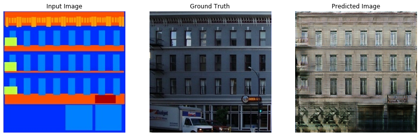
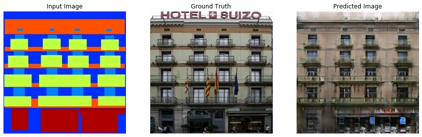
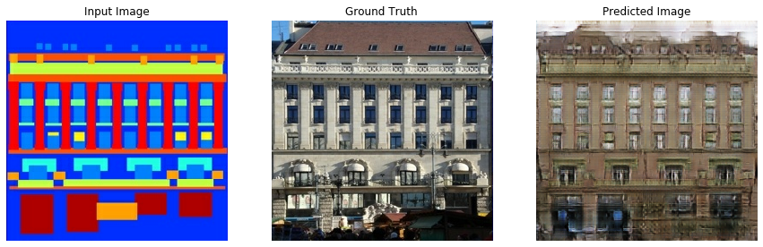

# Pix2Pix

Tensorflow Implementation of the paper [Image-to-Image Translation using Conditional GANs](https://arxiv.org/abs/1611.07004) by [Philip Isola](https://arxiv.org/search/cs?searchtype=author&query=Isola%2C+P), [Jun-Yan Zhu](https://arxiv.org/search/cs?searchtype=author&query=Zhu%2C+J), [Tinghui Zhou](https://arxiv.org/search/cs?searchtype=author&query=Zhou%2C+T) and [Alexei A. Efros](https://arxiv.org/search/cs?searchtype=author&query=Efros%2C+A+A).


## Architecture

### Generator

- The Generator is a Unet-Like model with skip connections between encoder and decoder.
- Encoder Block is ```Convolution -> BatchNormalization -> Activation (LeakyReLU)```
- Decode Blocks is ```Conv2DTranspose -> BatchNormalization -> Dropout (optional) -> Activation (ReLU)```


### Discriminator

- PatchGAN Discriminator
- Discriminator Block is ```Convolution -> BatchNormalization -> Activation (LeakyReLU)```


## Loss Functions

### Generator Loss


The Loss function can also be boiled down to

```Loss = GAN_Loss + Lambda * L1_Loss, where GAN_Loss is Sigmoid Cross Entropy Loss and Lambda = 100``` (determined by the authors)

### Discriminator Loss

The Discriminator Loss function can be written as

```Loss = disc_loss(real_images, array of ones) + disc_loss(generated_images, array of ones)```

where `disc_loss` is Sigmoid Cross Entropy Loss.

## Training Procedure

- Input Image is given to Generator which gives the generated image
- Discriminator recieves the (Input Image, Generated Image) and (Input Image, Target Image or Ground Truth)
- Compute Loss and Gradients (which are applied to the respective optimizer)

## Experiment 1: [Facades](https://people.eecs.berkeley.edu/~tinghuiz/projects/pix2pix/datasets/facades.tar.gz)



