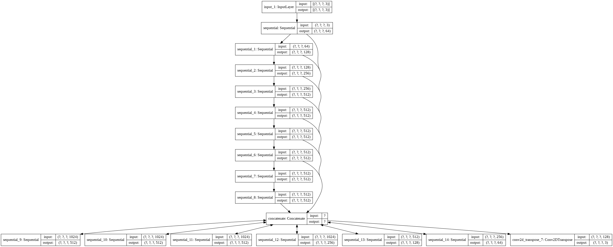
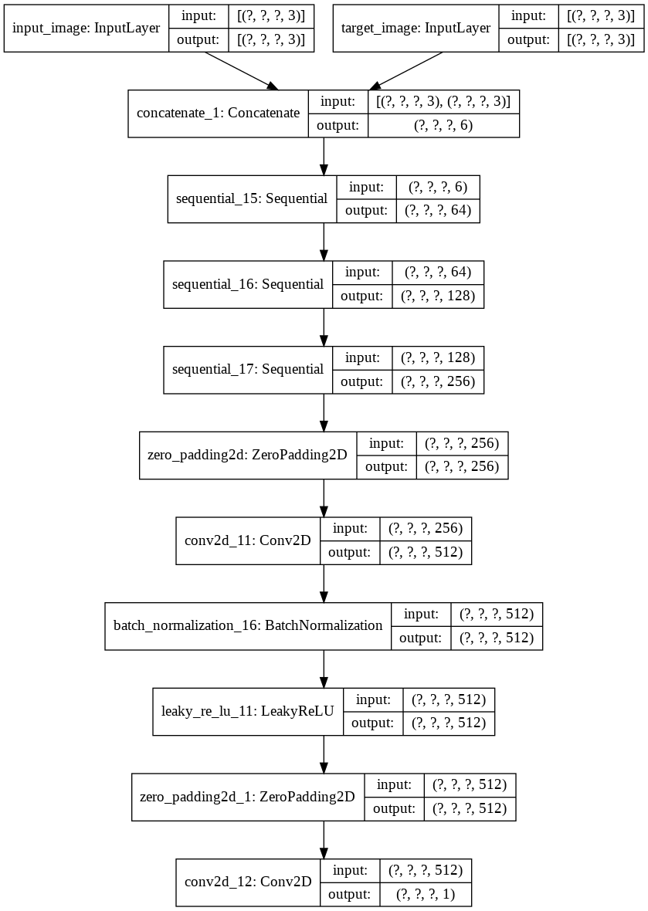
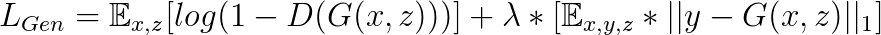
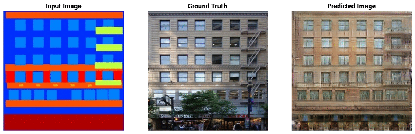
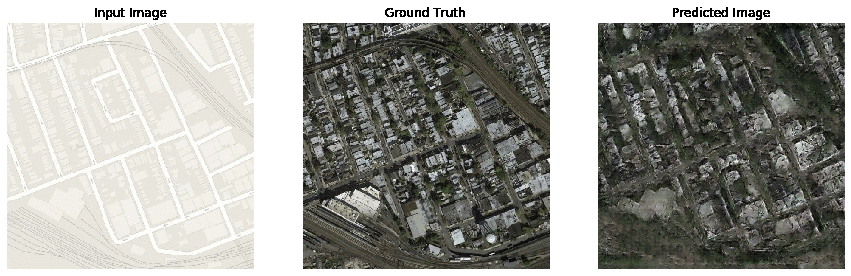
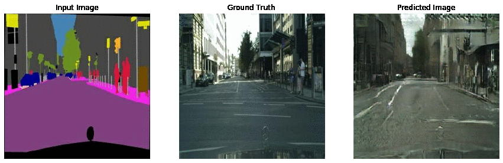
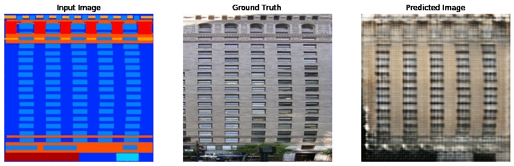
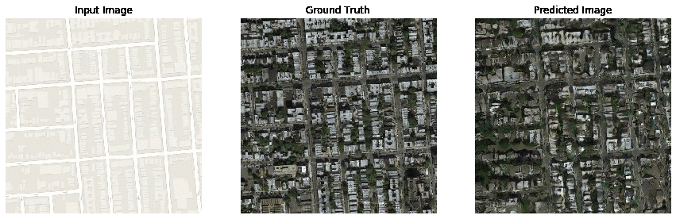
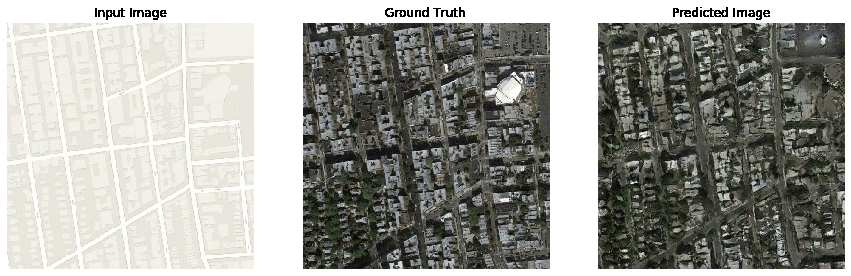

# Pix2Pix

[](https://mybinder.org/v2/gh/soumik12345/Pix2Pix/master)
[](https://paperswithcode.com/sota/image-to-image-translation-on-aerial-to-map?p=image-to-image-translation-with-conditional)
[](https://paperswithcode.com/sota/image-to-image-translation-on-cityscapes?p=image-to-image-translation-with-conditional)
[](https://paperswithcode.com/sota/image-to-image-translation-on-cityscapes-1?p=image-to-image-translation-with-conditional)
[](http://hits.dwyl.io/soumik12345/Pix2Pix)


Tensorflow 2.0 Implementation of the paper [Image-to-Image Translation using Conditional GANs](https://arxiv.org/abs/1611.07004) by [Philip Isola](https://arxiv.org/search/cs?searchtype=author&query=Isola%2C+P), [Jun-Yan Zhu](https://arxiv.org/search/cs?searchtype=author&query=Zhu%2C+J), [Tinghui Zhou](https://arxiv.org/search/cs?searchtype=author&query=Zhou%2C+T) and [Alexei A. Efros](https://arxiv.org/search/cs?searchtype=author&query=Efros%2C+A+A).


## Architecture

### Generator

- The Generator is a Unet-Like model with skip connections between encoder and decoder.
- Encoder Block is ```Convolution -> BatchNormalization -> Activation (LeakyReLU)```
- Decode Blocks is ```Conv2DTranspose -> BatchNormalization -> Dropout (optional) -> Activation (ReLU)```



### Discriminator

- PatchGAN Discriminator
- Discriminator Block is ```Convolution -> BatchNormalization -> Activation (LeakyReLU)```



## Loss Functions

### Generator Loss



The Loss function can also be boiled down to

```Loss = GAN_Loss + Lambda * L1_Loss```, where GAN_Loss is Sigmoid Cross Entropy Loss and Lambda = 100 (determined by the authors)

### Discriminator Loss

The Discriminator Loss function can be written as

```Loss = disc_loss(real_images, array of ones) + disc_loss(generated_images, array of zeros)```

where `disc_loss` is Sigmoid Cross Entropy Loss.

## Experiments with Standard Architecture

### [Experiment 1](./Pix2Pix_Facades.ipynb)

**Resource Credits:** Trained on Nvidia Quadro M4000 provided by [Paperspace Gradient](https://gradient.paperspace.com/).

**Dataset:** [Facades](https://people.eecs.berkeley.edu/~tinghuiz/projects/pix2pix/datasets/facades.tar.gz)

**Result:**



### [Experiment 2](./Pix2Pix_Maps.ipynb)

**Resource Credits:** Trained on Nvidia Quadro P5000 provided by [Paperspace Gradient](https://gradient.paperspace.com/).

**Dataset:** [Maps](https://people.eecs.berkeley.edu/~tinghuiz/projects/pix2pix/datasets/maps.tar.gz)

**Result:**



### [Experiment 3](./Pix2Pix_Cityscapes.ipynb)

**Resource Credits:** Trained on Nvidia Tesla V100 provided by [DeepWrex Technologies](https://deepwrex.com/).

**Dataset:** [Cityscapes](https://people.eecs.berkeley.edu/~tinghuiz/projects/pix2pix/datasets/cityscapes.tar.gz)

**Result:**



## Experiments with Mish Activation Function

### [Experiment 1 Mish](./Pix2Pix_Facades_Mish.ipynb)

**Resource Credits:** Trained on Nvidia Quadro P5000 provided by [Paperspace Gradient](https://gradient.paperspace.com/).

**Dataset:** [Facades](https://people.eecs.berkeley.edu/~tinghuiz/projects/pix2pix/datasets/facades.tar.gz)

**Generator Architecture:**

- The Generator is a Unet-Like model with skip connections between encoder and decoder.
- Encoder Block is ```Convolution -> BatchNormalization -> Activation (Mish)```
- Decode Blocks is ```Conv2DTranspose -> BatchNormalization -> Dropout (optional) -> Activation (Mish)```

**Discriminator:**

- PatchGAN Discriminator
- Discriminator Block is ```Convolution -> BatchNormalization -> Activation (Mish)```

**Result:**



### [Experiment 2 Mish](./Pix2Pix_Maps_Mish.ipynb)

**Resource Credits:** Trained on Nvidia Tesla P100 provided by [Google Colab](https://colab.research.google.com/).

**Dataset:** [Facades](https://people.eecs.berkeley.edu/~tinghuiz/projects/pix2pix/datasets/maps.tar.gz)

**Generator Architecture:**

- The Generator is a Unet-Like model with skip connections between encoder and decoder.
- Encoder Block is ```Convolution -> BatchNormalization -> Activation (Mish)```
- Decode Blocks is ```Conv2DTranspose -> BatchNormalization -> Dropout (optional) -> Activation (Mish)```

**Discriminator:**

- PatchGAN Discriminator
- Discriminator Block is ```Convolution -> BatchNormalization -> Activation (ReLU)```

**Result:**



### [Experiment 3 Mish](./Pix2Pix_Maps_Mish.ipynb)

**Resource Credits:** Trained on Nvidia Quadro P5000 provided by [Paperspace Gradient](https://gradient.paperspace.com/).

**Dataset:** [Facades](https://people.eecs.berkeley.edu/~tinghuiz/projects/pix2pix/datasets/maps.tar.gz)

**Generator Architecture:**

- The Generator is a Unet-Like model with skip connections between encoder and decoder.
- Encoder Block is ```Convolution -> BatchNormalization -> Activation (Mish)```
- Decode Blocks is ```Conv2DTranspose -> BatchNormalization -> Dropout (optional) -> Activation (Mish)``` for the first three blocks are ```Conv2DTranspose -> BatchNormalization -> Dropout (optional) -> Activation (ReLU)```

**Discriminator:**

- PatchGAN Discriminator
- Discriminator Block is ```Convolution -> BatchNormalization -> Activation (ReLU)```

**Result:**



## References

All the sources cited during building this codebase are mentioned below:

- [Image-to-Image Translation with Conditional Adversarial Networks](https://arxiv.org/pdf/1611.07004.pdf)
- [https://github.com/phillipi/pix2pix](https://github.com/phillipi/pix2pix)
- [Precomputed Real-Time Texture Synthesis with Markovian Generative Adversarial Networks](https://arxiv.org/abs/1604.04382)
- [Mish: A Self Regularized Non-Monotonic Neural Activation Function](https://arxiv.org/abs/1908.08681)
- [Tensorflow Pix2Pix](https://github.com/tensorflow/docs/blob/master/site/en/tutorials/generative/pix2pix.ipynb)
- [Keras Pix2Pix](https://github.com/eriklindernoren/Keras-GAN/blob/master/pix2pix/pix2pix.py)
